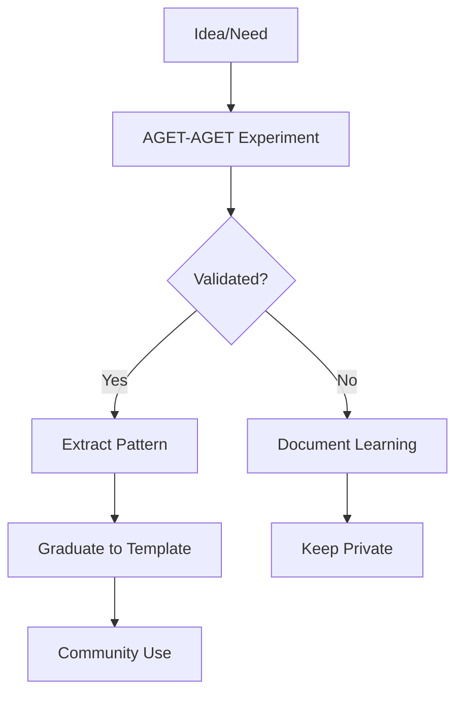

# Strategic Separation of Concerns

## Clear Boundaries Established

### What Lives in AGET-AGET (This Repository)
**Purpose**: Strategic governance, vision, and experimentation

- **Vision Documents** (`vision/`)
  - Cognitive spectrum definition
  - Future possibilities
  - Theoretical frameworks

- **Governance Documents** (`governance/`)
  - Strategic decisions
  - Roadmaps and planning
  - Charter and authority

- **Experiments** (`workspace/`)
  - Untested ideas
  - Radical approaches
  - Learning from failures

- **Case Studies** (`case_studies/`) [In Progress]
  - Real-world AGET creations
  - Pattern extraction sources
  - Validation examples

- **Session Documentation** (`sessions/`)
  - Learning from experiments
  - Validation results
  - Evolution tracking

### What Lives in aget-cli-agent-template (Public Framework)
**Purpose**: Stable, public implementation

- **Framework Code** (`src/`)
  - Core AGET implementation
  - Stable, tested features

- **Public Patterns** (`patterns/`)
  - Validated, universal patterns
  - Well-documented
  - Broadly useful

- **Usage Documentation** (`docs/`)
  - How-to guides
  - Getting started
  - API references

- **Templates** (`templates/`)
  - Starter configurations
  - Example setups

## The Flow

## Migration Completed
- ✅ Strategic documents moved to AGET-AGET
- ✅ Headers added noting migration
- ✅ Clear separation established
- ✅ Cross-references documented and validated
- ✅ Bidirectional pointers functioning correctly

## For Future Agents
When you encounter questions about:
- **Vision/Strategy** → Look in AGET-AGET
- **Implementation** → Look in aget-cli-agent-template
- **Experiments** → Try in AGET-AGET first
- **Stable patterns** → Use from template

---
*Separation established: 2025-09-25*