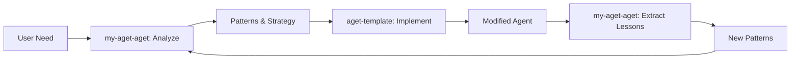

# Two-Agent Workflow Analysis
*Where today's conversation would happen in the future model*

## The Two Agents

### 1. aget-cli-agent-template (Action Agent)
- **Role**: Creates and modifies agents
- **Focus**: Implementation, building, doing
- **Knowledge**: Template patterns, agent structure

### 2. my-aget-aget (Governance/Strategy Agent)
- **Role**: Pattern extraction, strategy, governance
- **Focus**: Thinking, analyzing, documenting
- **Knowledge**: Cross-agent patterns, evolution, vision

## Today's Conversation Breakdown

### What Happened in my-aget-aget (Correct)
✅ **All strategic thinking and pattern discovery**
- Migration lessons from RKB_infra-aget
- Key management pattern identification
- Secrets manifest proposal
- Distributed governance vision
- Understanding gap analysis
- Public/private governance model
- Rename decision (aget-aget → my-aget-aget)
- Template extraction planning

### What SHOULD Have Happened in aget-cli-agent-template
❌ **The actual agent modifications**
- Creating RKB_infra-aget migration files
- Writing AGENTS_ENHANCED.md
- Creating .aget structure
- Implementing InfraGuard identity

## The Ideal Future Workflow

### Phase 1: Discovery & Analysis (my-aget-aget)
```markdown
User: "I need to convert RKB_infrastructure to an AGET"
my-aget-aget: "Let me analyze what patterns would help..."
- Reviews existing patterns
- Identifies gaps (auto-activation missing!)
- Documents lessons learned
- Creates governance decision
Output: Strategic guidance and pattern recommendations
```

### Phase 2: Implementation (aget-cli-agent-template)
```markdown
User: "Now implement the InfraGuard migration"
aget-template: "Creating AGET structure for InfraGuard..."
- Creates .aget/ directories
- Writes capabilities.json
- Implements identity
- Runs migration scripts
Output: Actual modified agent files
```

### Phase 3: Pattern Extraction (back to my-aget-aget)
```markdown
User: "What did we learn from this migration?"
my-aget-aget: "Extracting patterns from InfraGuard creation..."
- Documents auto-activation gap
- Creates security pattern
- Updates framework requirements
Output: New patterns for future use
```

## The Collaboration Pattern



## Specific Examples from Today

### RKB_infra-aget Migration

#### What my-aget-aget Should Have Done:
1. Analyze current state ✅ (investigation report)
2. Design InfraGuard identity ✅
3. Identify missing patterns ✅
4. Document lessons ✅

#### What aget-template Should Have Done:
1. Create .aget structure ❌ (we did it here)
2. Write AGENTS_ENHANCED.md ❌ (we did it here)
3. Implement capabilities.json ❌ (we did it here)
4. Run migration commands ❌ (we did it here)

### Key Management Pattern

#### my-aget-aget (Correct):
- Observed pattern from RKB_analytics ✅
- Documented security standards ✅
- Created secrets manifest proposal ✅
- Added to framework requirements ✅

#### aget-template (Would handle):
- Implementing .aget/secrets/ structure
- Creating validation scripts
- Adding to agent templates

## The Clean Separation

### my-aget-aget Domain
- **Thinking**: Strategy, patterns, governance
- **Documenting**: Lessons, decisions, discoveries
- **Analyzing**: Cross-agent patterns
- **Proposing**: New features, enhancements
- **Evolving**: Framework vision

### aget-template Domain
- **Doing**: Creating, modifying, implementing
- **Building**: Agents, structures, scripts
- **Testing**: Validations, migrations
- **Executing**: Commands, installations
- **Applying**: Patterns to actual code

## The Insight

Today's conversation was ~70% governance (correct location) and ~30% implementation (should have been in template). This reveals:

1. **Pattern Discovery Happens Through Doing** - We found patterns by implementing
2. **Iteration Required** - Think → Do → Learn → Think
3. **Agents Will Collaborate** - Not purely separated

## Future Conversation Flow

```markdown
# Session 1: my-aget-aget
User: "Help me understand AGET migration patterns"
my-aget-aget: [Analyzes, documents patterns, identifies gaps]
Output: MIGRATION_PATTERNS.md, requirements.json

# Session 2: aget-template
User: "Implement InfraGuard migration using these patterns"
aget-template: [Reads patterns, implements migration]
Output: RKB_infra-aget/ fully migrated

# Session 3: my-aget-aget
User: "What did we learn?"
my-aget-aget: [Extracts new patterns from implementation]
Output: Updated patterns, new requirements
```

## The Meta-Observation

Even this analysis document belongs in my-aget-aget! It's:
- Strategic thinking about workflow
- Pattern recognition
- Governance of how agents collaborate
- Not implementation

## Recommendations

1. **Clear Trigger Phrases**
   - my-aget-aget: "analyze", "patterns", "governance", "strategy"
   - aget-template: "create", "implement", "build", "modify"

2. **Information Passing**
   - my-aget-aget outputs: JSON patterns, markdown strategies
   - aget-template reads: Patterns and implements them

3. **Feedback Loop**
   - Implementation results feed back to governance
   - Governance creates new patterns from lessons

---
*Analysis Date: 2025-09-26*
*Insight: Separation is about thinking vs doing, not complete isolation*