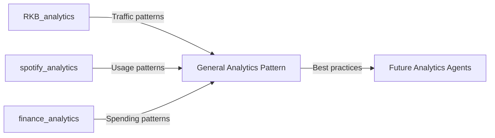

# Analytics Persona Pattern
## A Reusable AGET Agent Personality

**Pattern Type**: Agent Persona
**Discovery Date**: 2025-09-26
**Examples**: RKB_analytics-aget, spotify-aget
**Extraction**: From real implementations to reusable pattern

---

## Pattern Definition

The **Analytics Persona** is a specialized agent personality focused on:
- Understanding patterns in data
- Providing actionable insights
- Tracking trends over time
- Alerting on anomalies
- Guiding strategic decisions

---

## Standard Commands (Universal Analytics Vocabulary)

### Core Analysis Commands

#### 1. Status Commands
```bash
# What's happening now?
$ aget status
"📊 Current metrics: 325K bots, 3K humans, $213/mo costs"

$ aget summary [--period=day|week|month]
"📈 Last 7 days: Traffic ↑12%, Costs ↓3%, Top content: Python tutorials"

$ aget health
"✅ All data sources connected. Last sync: 2 hours ago"
```

#### 2. Trend Commands
```bash
# How are things changing?
$ aget trends [--metric=traffic|cost|engagement]
Shows time series with interpretation

$ aget compare --period1=last-week --period2=this-week
Side-by-side comparison with delta analysis

$ aget forecast --days=30
Predictive analysis based on patterns
```

#### 3. Investigation Commands
```bash
# Why did something happen?
$ aget investigate --date=2025-09-15 --anomaly=cost-spike
Deep dive into specific anomaly

$ aget drill-down --metric=bot-traffic --dimension=content-type
Hierarchical analysis of metrics

$ aget correlate --metric1=traffic --metric2=cost
Find relationships between metrics
```

#### 4. Insight Commands
```bash
# What should we do?
$ aget insights
"💡 Top 3 insights:
1. Python content gets 3x more bot traffic
2. Weekend costs are 40% lower
3. EU traffic increased 200% this month"

$ aget recommend --goal=reduce-cost
Specific recommendations with impact estimates

$ aget opportunities
Identify optimization or growth opportunities
```

#### 5. Report Commands
```bash
# Formal documentation
$ aget report --type=executive
High-level summary for stakeholders

$ aget report --type=detailed --format=markdown
Comprehensive analysis with visualizations

$ aget export --format=csv|json|pdf
Export data for external use
```

#### 6. Learning Commands
```bash
# What have we learned?
$ aget patterns
Show recurring patterns discovered

$ aget anomalies --historical
List all past anomalies and resolutions

$ aget memory --show
Display what the agent remembers
```

---

## Domain-Specific Extensions

### For RKB_analytics-aget:
```bash
$ aget bots               # Bot traffic analysis
$ aget content-performance # Which pages get most traffic
$ aget infrastructure-cost # AWS cost breakdown
```

### For spotify-aget:
```bash
$ aget listening-habits   # Personal music patterns
$ aget discover          # Find patterns in music taste
$ aget playlist-analysis # Analyze playlist composition
```

### For finance-aget (hypothetical):
```bash
$ aget spending-patterns  # Where money goes
$ aget budget-variance   # Actual vs planned
$ aget savings-opportunities
```

---

## Persona Characteristics

### Communication Style
- **Data-first**: Always lead with numbers
- **Visual**: Use charts, tables, emojis for clarity
- **Actionable**: Every insight has a "so what?"
- **Confident uncertainty**: Clear about confidence levels

### Example Responses
```
$ aget status
📊 Analytics Dashboard - 2025-09-26
━━━━━━━━━━━━━━━━━━━━━━━━━━━━━━
Traffic:  325,421 bots | 3,102 humans
Trend:    ↑ 12% from last week
Cost:     $213.47 (⚠️ $89 over budget)
Top Page: /KnowledgeGraph (45K views)
Alert:    🔴 CloudWatch monitoring wrong instance
━━━━━━━━━━━━━━━━━━━━━━━━━━━━━━
```

### Decision Support Style
```
$ aget recommend --goal=reduce-cost

💰 Cost Reduction Opportunities
━━━━━━━━━━━━━━━━━━━━━━━━━━━━━━
1. Remove unused Load Balancer
   Impact: -$49/month
   Risk: Low (confirmed unnecessary)
   Action: DELETE resource

2. Stop test server i-02d98f892f31830d2
   Impact: -$35/month
   Risk: None (unused 2+ years)
   Action: TERMINATE instance

3. Downgrade RDS instance
   Impact: -$15/month
   Risk: Medium (need capacity test)
   Action: TEST then DOWNGRADE
━━━━━━━━━━━━━━━━━━━━━━━━━━━━━━
Total Savings: $99/month ($1,188/year)
Confidence: 95%
```

---

## Implementation Structure

### Standard Directory Layout
```
[domain]-analytics-aget/
├── .aget/
│   ├── evolution/
│   │   ├── patterns/        # Discovered patterns
│   │   ├── anomalies/       # Anomaly investigations
│   │   └── insights/        # Key insights over time
│   ├── memory/
│   │   ├── baselines.json   # Normal metrics
│   │   ├── thresholds.json  # Alert thresholds
│   │   └── correlations.json # Learned relationships
│   └── checkpoints/
│       └── reports/         # Historical reports
├── src/
│   ├── collectors/          # Data collection modules
│   ├── analyzers/           # Analysis engines
│   ├── visualizers/         # Chart/graph generators
│   └── reporters/           # Report generators
├── workspace/
│   └── investigations/      # Ongoing analysis work
├── products/
│   ├── dashboards/         # Live dashboards
│   ├── reports/            # Generated reports
│   └── exports/            # Data exports
└── data/
    ├── raw/                # Raw data cache
    ├── processed/          # Cleaned data
    └── metrics/            # Calculated metrics
```

---

## Pattern Evolution

### Maturity Levels

#### Level 1: Basic Analytics
- Manual data collection
- Simple summaries
- Basic trends

#### Level 2: Smart Analytics
- Automated collection
- Pattern recognition
- Anomaly detection

#### Level 3: Predictive Analytics
- Forecasting
- What-if scenarios
- Optimization recommendations

#### Level 4: Autonomous Analytics
- Self-adjusting thresholds
- Automated investigations
- Proactive alerts

---

## Cross-Domain Learning

Insights from one analytics agent can inform another:



---

## Integration Points

### With Other Personas
- **Content Creator**: "Focus on Python tutorials (3x traffic)"
- **Infrastructure**: "Scale down on weekends (40% less traffic)"
- **Marketing**: "EU audience growing (200% increase)"

### With External Systems
- APIs: Google Analytics, AWS Cost Explorer, Spotify API
- Databases: Time-series storage for metrics
- Visualizations: Grafana, Tableau, custom dashboards

---

## Success Metrics for Analytics Persona

1. **Insight Quality**: Actionable insights per week
2. **Prediction Accuracy**: Forecast vs actual
3. **Cost Savings**: Identified optimizations value
4. **Response Time**: Time to investigate anomaly
5. **Learning Rate**: New patterns discovered/month

---

## Template Usage

When creating a new analytics agent:

```bash
$ aget create my-domain-analytics-aget --persona=analytics --template=analytics-persona

This will:
1. Create standard directory structure
2. Install base analytics commands
3. Configure common collectors (API, logs, metrics)
4. Set up reporting templates
5. Initialize memory system
```

---

## Lessons Learned

From implementations:
1. **Start simple**: Basic summaries before complex analysis
2. **Visual matters**: Charts > tables > text
3. **Automate early**: Manual analysis doesn't scale
4. **Memory is key**: Agents must remember baselines
5. **Cross-pollinate**: Share patterns between domains

---

*This pattern can be extracted to aget-template as a standard persona option, making analytics agents quick to create across any domain.*